# CSG_Blockout Architecture Design & Technical Internals

*Read this in other languages: [简体中文](ARCHITECTURE_CN.md) | [Back to Main Docs](README.md)*

This document is intended for developers interested in the underlying implementation, algorithmic designs, and extensibility of `CSG_Blockout`. It provides technical specifications and architectural breakdowns.

---

## Table of Contents
- [1. Core Algorithm: 3D Spatial Hash Grid](#1-core-algorithm-3d-spatial-hash-grid)
- [2. System Architecture & Design Patterns](#2-system-architecture--design-patterns)
- [3. Procedural World-Aligned Triplanar Shader](#3-procedural-world-aligned-triplanar-shader)
- [4. GDScript 2.0 Typing & Defensive Architecture](#4-gdscript-20-typing--defensive-architecture)
- [5. Node Specifications & API Reference](#5-node-specifications--api-reference)
- [6. ProjectSettings Specification](#6-projectsettings-specification)

---

## 1. Core Algorithm: 3D Spatial Hash Grid

### 1. The O(N^2) Bottleneck of Naive Checking
In scatter placement calculations (`CSGSpreader3D`), naive algorithms prevent instance overlapping by iterating through all previously placed points for each candidate point:

$$\text{Complexity} = \mathcal{O}(N^2)$$

When populating hundreds of complex CSG geometric instances in real-time, performing hundreds of thousands of 3D distance checks per second causes significant frame drops and editor freezes.

### 2. Spatial Hash Grid Implementation
`CSG_Blockout` implements the 3D spatial hash grid directly inside `CSGSpreader3D`, using a `Dictionary` keyed by `Vector3i` cell coordinates:

1. **Cell Size Determination**:
   Given the user-defined minimum distance $d_{\min}$ (`min_distance`), the cubic grid cell size is set to:
   $$\text{Cell Size} = d_{\min}$$
   Any two points within $d_{\min}$ of each other can never differ by more than $d_{\min}$ along a single axis, so they always land in cells that are at most one apart in each dimension. This guarantees that the 27-cell neighborhood below covers every possible collision candidate.

2. **Spatial Quantization & Hash Mapping**:
   Any continuous 3D world coordinate $\mathbf{P}(x, y, z)$ is discretized into integer cell indices:
   $$\mathbf{cell\_coords} = \left( \lfloor x / \text{CellSize} \rfloor, \lfloor y / \text{CellSize} \rfloor, \lfloor z / \text{CellSize} \rfloor \right)$$
   Stored using `Vector3i` keys inside a hash table for constant-time lookup.

3. **27-Neighborhood Search (3x3x3 Locality)**:
   When validating a placement candidate, the algorithm queries only the host cell and its immediate 26 adjacent cells (27 cells total), reducing collision verification to:
   $$\text{Collision Check Complexity} = \mathcal{O}(1)$$

---

## 2. System Architecture & Design Patterns

```mermaid
graph TD
    subgraph Editor Core
        Plugin["csg_blockout.gd (EditorPlugin)"]
        URM["EditorUndoRedoManager"]
        I18N["CsgBlockoutI18n"]
        ProjSet["ProjectSettings (addons/csg_blockout/*)"]
    end

    subgraph UI & Controls
        Pie["CSGBlockoutPieMenu (Vector 2D/3D Viewport)"]
        SideBar["CSGSideBlockoutBar (Left Viewport Bar)"]
        TopBar["CSGTopBlockoutBar (Viewport Header Bar)"]
    end

    subgraph Node Domain
        Combiner["CSGCombiner3D (Godot Built-in)"]
        Repeater["CSGRepeater3D"] --> Combiner
        Spreader["CSGSpreader3D"] --> Combiner
    end

    subgraph Strategy Pattern
        Pattern["CSGPattern (Resource)"]
        GridPat["CSGGridPattern"] --> Pattern
        CircPat["CSGCircularPattern"] --> Pattern
        SpiralPat["CSGSpiralPattern"] --> Pattern
        NoisePat["CSGNoisePattern"] --> Pattern
        Repeater -.-> Pattern
    end

    subgraph Collision & Placement
        HashGrid["Inline Spatial Hash Grid (O(1) lookup)"]
        Spreader -.-> HashGrid
        Spreader -.-> ShapeDomain["Shape3D (Box/Sphere/Mesh/...)"]
    end

    Plugin --> Pie
    Plugin --> SideBar
    Plugin --> TopBar
```

### 1. Strategy Pattern: Array Generator (`CSGRepeater3D`)
`CSGRepeater3D` delegates spatial array calculations to modular `CSGPattern` resources:
- **`CSGGridPattern`**: Orthogonal 3D Cartesian array with automatic bounding box (AABB) compensation.
- **`CSGCircularPattern`**: Multi-tiered radial polar array.
- **`CSGSpiralPattern`**: Archimedean/logarithmic spiral distribution with optional non-linear `Curve` radial modulation.
- **`CSGNoisePattern`**: Volumetric 3D noise threshold sampling via `FastNoiseLite`.

### 2. Shape3D Bounding Domain: Scatterer (`CSGSpreader3D`)
`CSGSpreader3D` accepts any Godot `Shape3D` as a spatial boundary:
- Computes world-space bounding boxes.
- Executes rejection sampling inside custom shapes.
- Enforces strict minimum distance thresholds via its built-in spatial hash grid.
- Implements fallback safety limits (`max_placement_attempts`).

---

## 3. Procedural World-Aligned Triplanar Shader

`grid_triplanar.gdshader` is engineered specifically for level prototyping:
1. **World-Space Triplanar Mapping**:
   - Bypasses mesh UV coordinates; samples texture procedurally from world coordinates $\mathbf{P}_{\text{world}}$.
   - Guarantees 1m x 1m grid alignment regardless of node transformation or boolean cutting.
2. **Hardware Screen-Derivative Anti-Aliasing**:
   - Employs `fwidth()` and `smoothstep()` for sub-pixel anti-aliased grid lines, eliminating distant moiré patterns.
3. **Zero Texture Footprint**:
   - Procedural math generation with zero VRAM bandwidth overhead.

---

## 4. GDScript 2.0 Typing & Defensive Architecture

- **Strict Static Typing**: Explicit typing on all methods and variables, optimizing engine dispatch.
- **ClassDB Validation**: Dynamic node instantiation validated via `ClassDB.instantiate()` and type checks.
- **Atomic Undo/Redo**: Full integration with `EditorUndoRedoManager` for node creation, property editing, material assignments, and instance baking (`CSGRepeater3D` / `CSGSpreader3D`).
- **Editor / Runtime Decoupling**: Tool scripts strictly gated with `Engine.is_editor_hint()` to prevent runtime leaks and scene corruption.

---

## 5. Node Specifications & API Reference

### 1. CSGRepeater3D Properties

| Property | Type | Default | Description |
| :--- | :--- | :--- | :--- |
| `template_node` | `Node3D` | `null` | Node in scene tree used as instance template. |
| `template_node_scene` | `PackedScene` | `null` | Template PackedScene resource (fallback if `template_node` is null). |
| `hide_template` | `bool` | `true` | Automatically hides template node when array is generated. |
| `pattern` | `CSGPattern` | `null` | Pattern resource defining distribution layout. |
| `position_jitter` | `float` | `0.0` | Minor random translation variance. |
| `random_seed` | `int` | `0` | Seed for pseudorandom generator. |
| `estimated_instances` | `int` | `0` | (Read-only) Estimated number of instances to be generated. |
| `randomize_rotation` | `bool` | `false` | Enables rotation variance. |
| `randomize_rot_x/y/z` | `bool` | `false` | Per-axis rotation toggles. |
| `rotation_variance_x/y/z_deg` | `float` | `0.0` | Random variance angle in degrees (0 = full 360-degree). |
| `randomize_scale` | `bool` | `false` | Enables scale variance. |
| `scale_variance` | `float` | `0.0` | Uniform scale variance factor. |

### 2. CSGSpreader3D Properties

| Property | Type | Default | Description |
| :--- | :--- | :--- | :--- |
| `template_node` | `Node3D` | `null` | Target template node to scatter. |
| `spread_area_3d` | `Shape3D` | `null` | Spatial boundary shape (Box, Sphere, Capsule, Mesh, etc.). |
| `max_count` | `int` | `10` | Maximum instance limit (hard capped at 200). |
| `noise_threshold` | `float` | `0.5` | Noise density threshold (0.0 to 1.0). |
| `seed` | `int` | `0` | Random seed. |
| `avoid_overlaps` | `bool` | `false` | Enables Spatial Hash collision prevention. |
| `min_distance` | `float` | `1.0` | Minimum safe distance between origins. |
| `max_placement_attempts` | `int` | `100` | Maximum candidate search attempts per instance. |
| `allow_rotation` | `bool` | `false` | Enables random Y-axis yaw rotation. |
| `allow_scale` | `bool` | `false` | Enables random scale variance (0.5x to 2.0x). |

### 3. CSGStairs3D Properties

| Property | Type | Default | Description |
| :--- | :--- | :--- | :--- |
| `step_count` | `int` | `8` | Total number of stair steps (range 1 to 100). |
| `total_height` | `float` | `2.0` | Total stair rise height in meters (must be > 0). |
| `total_depth` | `float` | `3.0` | Total stair run depth along -Z axis in meters (must be > 0). |
| `width` | `float` | `1.5` | Stair width along X axis in meters. |
| `is_ramp` | `bool` | `false` | Smooth ramp mode toggle. Replaces stepped profile with a triangle slope for physics/gameplay prototyping. |
| `enable_ergonomic_warning` | `bool` | `true` | Enables ergonomic step ratio validation and inspector warnings. |
| `step_height` | `float` | `0.25` | (Read-only) Single step rise height (`total_height / step_count`). |
| `step_depth` | `float` | `0.375` | (Read-only) Single step run depth (`total_depth / step_count`). |
| `ergonomic_status` | `String` | `""` | (Read-only) Ergonomic evaluation status text. |

### 4. CSGRuler3D Properties

| Property | Type | Default | Description |
| :--- | :--- | :--- | :--- |
| `target_point` | `Vector3` | `Vector3(0, 0, -3)` | Endpoint coordinate relative to ruler origin in local 3D space. |
| `use_global_metrics` | `bool` | `true` | Whether to evaluate reachability using global ProjectSettings metrics or local overrides. |
| `character_height` | `float` | `1.8` | Standing eye-height and clearance baseline in meters (local override). |
| `single_jump_height` | `float` | `1.5` | Single vertical jump reach threshold in meters (local override). |
| `sprint_jump_distance` | `float` | `4.0` | Sprint jump horizontal span reach threshold in meters (local override). |
| `total_distance` | `float` | `3.0` | (Read-only) Euclidean 3D distance between origin and target point in meters. |
| `horizontal_distance` | `float` | `3.0` | (Read-only) Projected 2D horizontal span across XZ plane in meters. |
| `vertical_delta` | `float` | `0.0` | (Read-only) Vertical height difference along Y axis in meters. |
| `is_jump_reachable` | `bool` | `true` | (Read-only) Whether target point is within jump clearance bounds. |
| `reachability_status` | `String` | `"Reachable"` | (Read-only) Localized reachability status text ("Reachable" / "Unreachable"). |

---

## 6. ProjectSettings Specification

Configuration options are registered under `addons/csg_blockout/*`:

| Setting Path | Type | Default | Description |
| :--- | :--- | :--- | :--- |
| `addons/csg_blockout/action_key` | `int` (Key) | `KEY_SHIFT` | Primary action modifier key for 3D Pie Menu. |
| `addons/csg_blockout/auto_hide` | `bool` | `true` | Auto-hides left sidebar when no CSG node is selected. |
| `addons/csg_blockout/language_override` | `String` | `"auto"` | Language preference override (`"auto"`, `"en"`, `"zh_CN"`, `"ja"`, `"ko"`, `"es"`, `"pt"`, `"ru"`). |
| `addons/csg_blockout/material_preset` | `int` (Enum) | `1` (GRID_LIGHT) | Default active grid material preset. |
| `addons/csg_blockout/default_operation` | `int` (Enum) | `0` (Union) | Default CSG boolean operation for newly created nodes (shared by pie menu & sidebar). |
| `addons/csg_blockout/custom_material_path` | `String` | `""` | Resource path of the custom material used by the CUSTOM preset (persisted across editor sessions). |
| `addons/csg_blockout/player_metrics/character_height` | `float` | `1.8` | Standing character height baseline in meters (ruler eye-level clearance reference). |
| `addons/csg_blockout/player_metrics/single_jump_height` | `float` | `1.5` | Single jump maximum vertical reach threshold in meters for reachability evaluation. |
| `addons/csg_blockout/player_metrics/sprint_jump_distance` | `float` | `4.0` | Sprint jump horizontal span reach threshold in meters for reachability evaluation. |
