# CSG_Blockout 架构设计与技术内幕

*其他语言版本: [English](ARCHITECTURE.md) | [返回主文档](README_CN.md)*

本文档面向对插件底层实现、算法细节以及二次开发感兴趣的开发者，详细阐述 `CSG_Blockout` 的核心算法设计、架构分层与完整 API 规范。

---

## 目录
- [一、 核心算法：3D 空间哈希网格 (Spatial Hash Grid)](#一-核心算法3d-空间哈希网格-spatial-hash-grid)
- [二、 系统架构与设计模式](#二-系统架构与设计模式)
- [三、 程序化世界对齐材质 Shader 设计](#三-程序化世界对齐材质-shader-设计)
- [四、 GDScript 2.0 规范与防御性设计](#四-gdscript-20-规范与防御性设计)
- [五、 节点与组件规格参考 (API Reference)](#五-节点与组件规格参考-api-reference)
- [六、 ProjectSettings 配置规范](#六-projectsettings-配置规范)

---

## 一、 核心算法：3D 空间哈希网格 (Spatial Hash Grid)

### 1. 传统暴力检测的性能瓶颈
在散布计算（`CSGSpreader3D`）中，为防止实例在 3D 体积内互相重叠穿模，朴素方案是对每一个候选位置与已有全部实例进行欧氏距离双重循环检测：

$$\text{复杂度} = \mathcal{O}(N^2)$$

当生成数百个高精度 CSG 几何体时，每秒数十万次的三维距离向量平方运算会导致 Godot 主线程严重卡顿，甚至触发编辑态未响应。

### 2. 空间哈希网格实现原理
`CSG_Blockout` 在 `scripts/csg_spatial_hash_3d.gd` 中构建了专用的 3D 空间哈希网格算法：

1. **单元格尺度计算**：
   给定用户设定的最小防重叠间距 $d_{\min}$（`min_distance`），网格单元尺寸定义为：
   $$\text{Cell Size} = \frac{d_{\min}}{\sqrt{3}}$$
   此尺寸保证了单个单元格内部不可能容纳两个间距大于等于 $d_{\min}$ 的候选点，极大精简了邻域碰撞可能性。

2. **空间坐标量化与哈希映射**：
   将任意浮点空间坐标 $\mathbf{P}(x, y, z)$ 离散化为整型网格坐标：
   $$\mathbf{cell\_coords} = \left( \lfloor x / \text{CellSize} \rfloor, \lfloor y / \text{CellSize} \rfloor, \lfloor z / \text{CellSize} \rfloor \right)$$
   使用基于 `Vector3i` 的字典键做常量时间寻址。

3. **27 邻域检索 (3x3x3 局部性查询)**：
   每次验证候选位置时，算法无需遍历全量数据，仅需检索当前单元格以及紧邻的 26 个邻近单元格（共 27 块），将冲突检测的时间复杂度降为：
   $$\text{候选冲突检测复杂度} = \mathcal{O}(1)$$

---

## 二、 系统架构与设计模式

```mermaid
graph TD
    subgraph Editor Core
        Plugin["csg_blockout.gd (EditorPlugin)"]
        URM["EditorUndoRedoManager"]
        I18N["CsgBlockoutI18n"]
        ProjSet["ProjectSettings (addons/csg_blockout/*)"]
    end

    subgraph UI & Controls
        Pie["CSGBlockoutPieMenu (Vector 2D/3D Viewport)"]
        SideBar["CSGSideBlockoutBar (Left Viewport Bar)"]
        TopBar["CSGTopBlockoutBar (Viewport Header Bar)"]
    end

    subgraph Node Domain
        Combiner["CSGCombiner3D (Godot Built-in)"]
        Repeater["CSGRepeater3D"] --> Combiner
        Spreader["CSGSpreader3D"] --> Combiner
    end

    subgraph Strategy Pattern
        Pattern["CSGPattern (Resource)"]
        GridPat["CSGGridPattern"] --> Pattern
        CircPat["CSGCircularPattern"] --> Pattern
        SpiralPat["CSGSpiralPattern"] --> Pattern
        NoisePat["CSGNoisePattern"] --> Pattern
        Repeater -.-> Pattern
    end

    subgraph Collision & Placement
        HashGrid["CSGSpatialHash3D (O(1) Spatial Hash)"]
        Spreader -.-> HashGrid
        Spreader -.-> ShapeDomain["Shape3D (Box/Sphere/Mesh/...)"]
    end

    Plugin --> Pie
    Plugin --> SideBar
    Plugin --> TopBar
```

### 1. 策略模式：阵列分发器 (`CSGRepeater3D`)
`CSGRepeater3D` 摆脱了传统的硬编码循环，将生成逻辑完全抽象为独立的 `CSGPattern` 资源策略：
- **`CSGGridPattern`**：正交笛卡尔网格阵列，支持 AABB 边界自适应计算。
- **`CSGCircularPattern`**：多层同心极坐标环形阵列。
- **`CSGSpiralPattern`**：阿基米德/对数螺旋分布，支持自定义非线性半径曲线（`Curve`）。
- **`CSGNoisePattern`**：基于 `FastNoiseLite` 的体域噪声阈值采样分布。

### 2. 物理碰撞体边界域：散布系统 (`CSGSpreader3D`)
`CSGSpreader3D` 支持任意 Godot `Shape3D` 作为散布边界，其工作流包括：
- 提取碰撞体的世界空间 AABB 边界。
- 执行内部包含性与随机拒识采样。
- 联动 `CSGSpatialHash3D` 进行实时防重叠过滤。
- 支持最大容错尝试机制（`max_placement_attempts`）。

---

## 三、 程序化世界对齐材质 Shader 设计

`grid_triplanar.gdshader` 是专为白盒原型搭建定制的着色器，核心技术特征包括：
1. **世界坐标三平面投影（World-Space Triplanar Mapping）**：
   - 弃用模型 UV 坐标，直接取顶点/片元的世界坐标 $\mathbf{P}_{\text{world}}$ 计算纹理采样。
   - 物体在三维空间中随意平移、旋转、缩放或执行布尔切削，网格材质的物理尺寸（如 1m x 1m）永不拉伸扭曲。
2. **硬件级解析度自适应抗锯齿**：
   - 利用导数函数 `fwidth()` 与 `smoothstep()` 计算网格边缘线，从根本上杜绝远处网格摩尔纹走样。
3. **性能开销最小化**：
   - 无贴图依赖，纯数学公式生成网格与棋盘格，零显存带宽浪费。

---

## 四、 GDScript 2.0 规范与防御性设计

- **全线静态强类型化**：所有脚本启用强类型签名，消除动态查找开销。
- **ClassDB 安全校验**：所有动态实例化节点均经由 `ClassDB.instantiate()` 或类型断言，杜绝无效类抛错。
- **原子级 Undo/Redo**：全面对接 Godot 4.7 `EditorUndoRedoManager`，涵盖节点增删、属性变更、层级迁移、材质覆盖。
- **编辑器与运行时完全解耦**：所有工具类逻辑严格置于 `Engine.is_editor_hint()` 防护内，杜绝运行时产生幽灵节点或内存泄漏。

---

## 五、 节点与组件规格参考 (API Reference)

### 1. CSGRepeater3D 属性参考

| 属性名 | 类型 | 默认值 | 说明 |
| :--- | :--- | :--- | :--- |
| `template_node` | `Node3D` | `null` | 引用场景树中作为阵列原型的节点。 |
| `template_node_scene` | `PackedScene` | `null` | 预制体模板资源（当未指定 `template_node` 时生效）。 |
| `hide_template` | `bool` | `true` | 生成阵列时自动隐藏原始模板节点。 |
| `pattern` | `CSGPattern` | `null` | 阵列分发策略资源。 |
| `position_jitter` | `float` | `0.0` | 位置微小随机抖动偏移量。 |
| `random_seed` | `int` | `0` | 伪随机数种子。 |
| `estimated_instances` | `int` | `0` | (只读) 预估生成的实例数量。 |
| `randomize_rotation` | `bool` | `false` | 启用旋转随机化。 |
| `randomize_rot_x/y/z` | `bool` | `false` | 各轴向旋转随机开关。 |
| `rotation_variance_x/y/z_deg` | `float` | `0.0` | 旋转随机浮动角度（设为 0 为 360 度全随机）。 |
| `randomize_scale` | `bool` | `false` | 启用缩放随机化。 |
| `scale_variance` | `float` | `0.2` | 等比缩放浮动量。 |

### 2. CSGSpreader3D 属性参考

| 属性名 | 类型 | 默认值 | 说明 |
| :--- | :--- | :--- | :--- |
| `template_node` | `Node3D` | `null` | 需要散布的目标模板节点。 |
| `spread_area_3d` | `Shape3D` | `null` | 散布空间域形状（Box, Sphere, Capsule 等）。 |
| `max_count` | `int` | `50` | 散布最大实例上限（硬上限保护为 200）。 |
| `noise_threshold` | `float` | `0.0` | 噪声概率过滤阈值（0.0 至 1.0）。 |
| `seed` | `int` | `1337` | 随机种子。 |
| `avoid_overlaps` | `bool` | `true` | 启用空间哈希碰撞避障检查。 |
| `min_distance` | `float` | `2.0` | 实例间最小安全间距。 |
| `max_placement_attempts` | `int` | `30` | 单个实例最大寻位采样尝试次数。 |
| `allow_rotation` | `bool` | `true` | 允许随机 Y 轴偏航旋转。 |
| `allow_scale` | `bool` | `true` | 允许随机缩放（0.5x 至 2.0x）。 |

---

## 六、 ProjectSettings 配置规范

插件所有全局配置项挂载于 Godot 项目设置 `addons/csg_blockout/*` 命名空间下：

| 配置键路径 | 类型 | 默认值 | 说明 |
| :--- | :--- | :--- | :--- |
| `addons/csg_blockout/action_key` | `int` (Key) | `KEY_SHIFT` | 3D 轮盘菜单主触发修饰键。 |
| `addons/csg_blockout/auto_hide` | `bool` | `true` | 视口未选中 CSG 节点时自动隐藏左侧边栏。 |
| `addons/csg_blockout/language_override` | `String` | `"zh_CN"` | 界面语言偏好覆盖 (`"en"` 或 `"zh_CN"`)。 |
| `addons/csg_blockout/material_preset` | `int` (Enum) | `1` (GRID_LIGHT) | 默认激活的网格材质预设通道。 |
