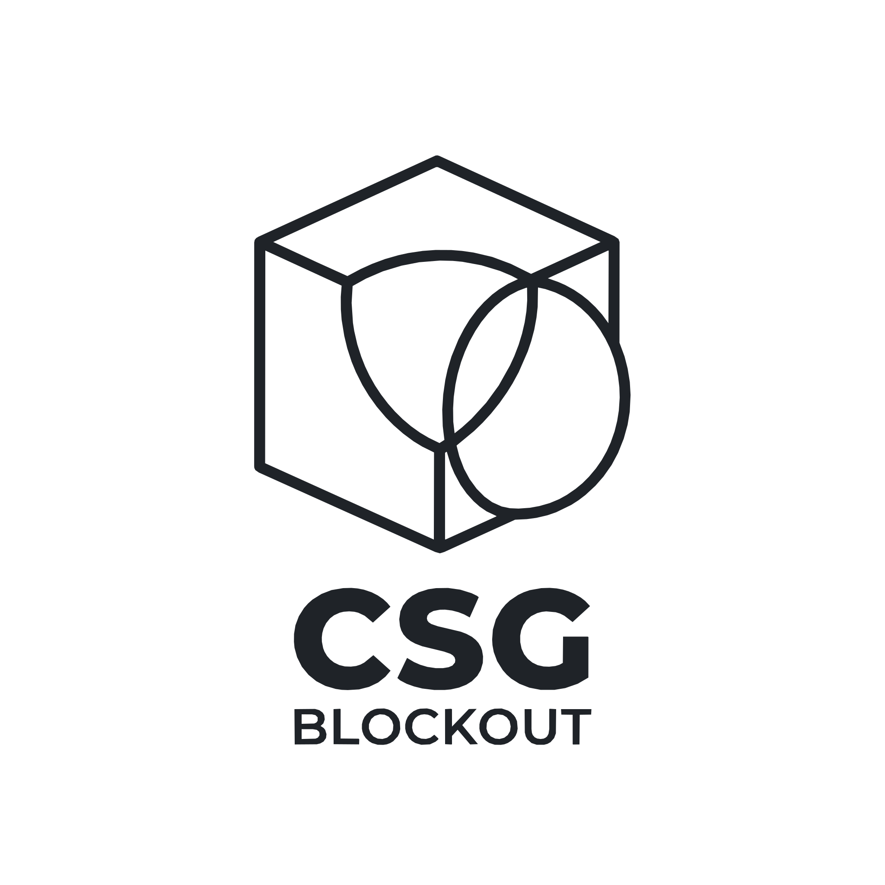

<div align="center">
  <picture>
    <source media="(prefers-color-scheme: dark)" srcset="res/icon_transparent.svg" />
    
  </picture>
  <h1>CSG_Blockout</h1>

  <p>
    <a href="README.md"></a>
    <a href="README_CN.md"></a>
    <a href="TUTORIAL_EN.md"></a>
    <a href="ARCHITECTURE.md"></a>
  </p>

  <p>
    <a href="https://godotengine.org"></a>
    <a href="https://store.godotengine.org/asset/qwqzhanqwq/csg-blockout/"></a>
    <a href="LICENSE"></a>
  </p>

  <p>
    <strong>A high-performance, modernized 3D level blockout and rapid prototyping plugin designed specifically for Godot 4.7.</strong>
  </p>
</div>

---

## Installation

### Option 1: Godot AssetLib (Recommended)
1. Open Godot 4.7 and navigate to the **AssetLib** tab at the top of the editor.
2. Search for `CSG Blockout`, download, and install it into your project.
3. Or view it directly on the web: [Godot AssetLib - CSG_Blockout](https://store.godotengine.org/asset/qwqzhanqwq/csg-blockout/).

### Option 2: GitHub Releases (.zip)
1. Download the latest release `.zip` from the [Releases page](https://github.com/qwqzhanqwq/Godot-CSG-Blockout/releases).
2. Extract the archive and copy the `addons/csg_blockout` directory into your Godot project's `addons/` folder.

### Option 3: Git Clone
Clone the repository directly into your project's `addons/` directory:
```bash
git clone https://github.com/qwqzhanqwq/Godot-CSG-Blockout.git addons/csg_blockout
```

### Enable the Plugin
In Godot, go to **Project -> Project Settings -> Plugins**, find **CSG_Blockout**, and check the **Enable** checkbox.

---

## Quick Start

1. **Invoke 3D Pie Menu**: Press `Shift + A` in the 3D viewport to open the vector radial menu directly at your cursor. Quickly create primitives or switch CSG operations (Union / Intersection / Subtraction) using mouse gestures.
2. **Use the Viewport Sidebar**: The left sidebar provides one-click creation for 6 standard shapes. It automatically adds nodes as children when selecting a `CSGCombiner3D`, or as adjacent siblings when selecting standard shapes.
3. **Procedural World-Aligned Grid**: Switch between Light Grid, Dark Grid, or Orange Accent presets. Select multiple CSG nodes in the tree or viewport and click **"Apply Material to Selected"** to batch-assign without texture distortion.
4. **Bake to Permanent Nodes**: When a `CSGRepeater3D` or `CSGSpreader3D` is selected, click **Bake** in the 3D header toolbar to detach generated instances into permanent scene nodes.

> For a complete visual walkthrough and performance optimization workflow, check the [Quick Start & Advanced Workflow Tutorial (TUTORIAL_EN.md)](TUTORIAL_EN.md).

---

## Key Features

- **Vector 3D Pie Menu**: Triggered with `Shift + A` in the 3D viewport. Hierarchical radial navigation for instant CSG operations and primitive placement with central deadzone controls and full Undo/Redo integration.
- **Smart Viewport Sidebar**: Quick-access toolbar for 6 primitive shapes and boolean modes. Auto-hides when no CSG nodes are selected to keep the viewport clean.
- **Procedural World-Aligned Triplanar Shader**: World-space UV projection guarantees consistent 1m x 1m grid scaling without stretching during node transformations or CSG boolean cuts. Built-in screen-derivative anti-aliasing.
- **Ready-to-Use Material Presets & Batch Assignment**: Pre-configured measurement materials (Light, Dark, Accent, Unshaded) with one-click batch application to all selected CSG nodes.
- **Parametric Array Generator (CSGRepeater3D)**: Strategy-pattern array distributions (Grid, Circular, Spiral, and 3D Noise volume sampling) with randomized rotation and scale.
- **Volume Collision Scatterer (CSGSpreader3D)**: Scatter instances within any Godot `Shape3D` volume without overlaps. Powered by a custom $\mathcal{O}(1)$ 3D Spatial Hash Grid algorithm.
- **GDScript 2.0 Static Typing & Dual Localization**: Fully typed codebase, atomic `EditorUndoRedoManager` support (`Ctrl + Z` / `Ctrl + Y`), and built-in English and Simplified Chinese (i18n) localization.

---

## Relationship to CSG Toolkit & Architectural Evolution

This plugin originated from the excellent open-source [CSG Toolkit](https://godotengine.org/asset-library/asset/3057) created by **LuckyTepot**. While the original toolkit demonstrated the value of in-viewport CSG authoring, modern Godot 4.7 workflows demanded higher performance, procedural tooling, and cleaner architecture.

`CSG_Blockout` was re-engineered by [qwqzhanqwq](https://github.com/qwqzhanqwq) as a **ground-up architectural overhaul**:

| Dimension | Original CSG Toolkit | CSG_Blockout (This Project) |
| :--- | :--- | :--- |
| **Engine Core** | Early Godot 4.x, dynamically typed | **Tailored for Godot 4.7+**, full GDScript 2.0 static typing & ClassDB validation |
| **Interaction** | Viewport sidebar only | **3D Viewport Radial Pie Menu (`Shift + A`) + Smart Sidebar** dual workflow |
| **Procedural Tools**| Static manual primitive placement | **Parametric Repeaters (`CSGRepeater3D`) + Volume Spreaders (`CSGSpreader3D`)** |
| **Scatter Algorithm**| No collision avoidance or naive $\mathcal{O}(N^2)$ | **Custom 3D Spatial Hash Grid ($\mathcal{O}(1)$ lookup)**, real-time calculation |
| **Materials** | Basic default materials | **World-aligned triplanar anti-aliased shader** + 5 presets + 1-click batch assign |
| **Robustness** | Basic editor state | **Atomic `EditorUndoRedoManager` integration** with strict editor/runtime decoupling |
| **Localization** | English only | **Native dual language support** (Simplified Chinese & English) |

---

## Documentation

- [Quick Start & Advanced Workflow Tutorial (TUTORIAL_EN.md)](TUTORIAL_EN.md): Step-by-step guide, visual demonstrations, and the critical CSG-to-Mesh baking workflow.
- [Architecture Design & Technical Internals (ARCHITECTURE.md)](ARCHITECTURE.md): Spatial Hash Grid algorithm derivation, design patterns, and complete API specifications.
- [Project Roadmap (ROADMAP_CN.md)](ROADMAP_CN.md): Future milestones and development roadmap.

---

## Credits & License

- **Original Concept & Layout Design**: [LuckyTepot](https://github.com/LuckyTepot) (CSG Toolkit, Copyright (c) 2023).
- **Architecture Overhaul, 3D Pie Menu, Spatial Hash Grid, Array/Scatter Systems & GDScript 2.0 Rewrite**: [qwqzhanqwq](https://github.com/qwqzhanqwq) (Copyright (c) 2026).

Licensed under the [MIT License](LICENSE).
